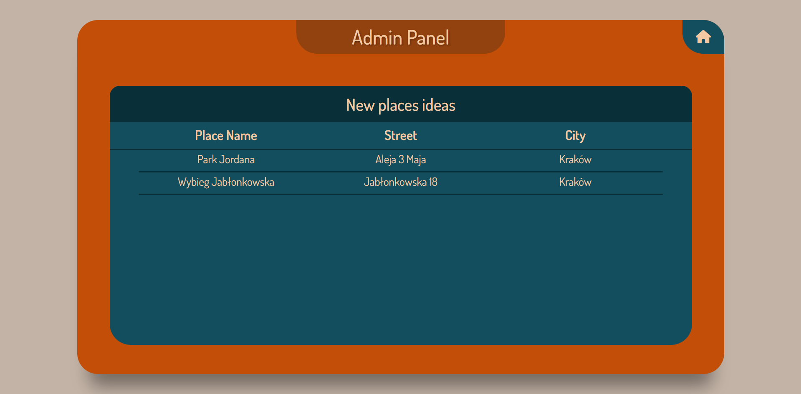

# DogOut

> Website to plan a walk with your doggy.

## Table of contents

* [General Information](#general-information)
* [Technologies Used](#technologies-used)
* [Features](#features)
* [Screenshots](#screenshots)
* [Launch](#launch)
* [Project Status](#project-status)
* [Room For Improvement](#room-for-improvement)

## General Information

This application will help you to choose a proper place to go with your dog.
It contains information about other people's dogs and where they are.
There are the most popular places where you can go and mark your activity in the application.

## Technologies Used

- HTML5
- CSS3
- JavaScript
- PHP 7.4.3
- PostGreSQL
- Docker
- Git
- Heroku
- NGINX

## Features

- The user can add his dog to the application
- The user can mark his presence in the place that he has chosen
- The user is able to see all dogs with information about them in specific place
- The user can send an information about new place that he would like to be added to the application
- The user can delete his dog in case he provided wrong data
- The admin can check users' ideas in his panel

## Screenshots

## Launch

To launch this project you need to open Docker Application, then open the terminal in main directory of the project. Type `docker-compose up` in the terminal and then open your browser. Type `localhost:8080` in the address bar to enjoy the application.

## Project Status

The project is _complete_ for the basic usage.

## Room for Improvement

- Add friends mechanism so the user can see where other people that he knows are
- Add more places
- Add more cities
- Possibility of adding more dogs